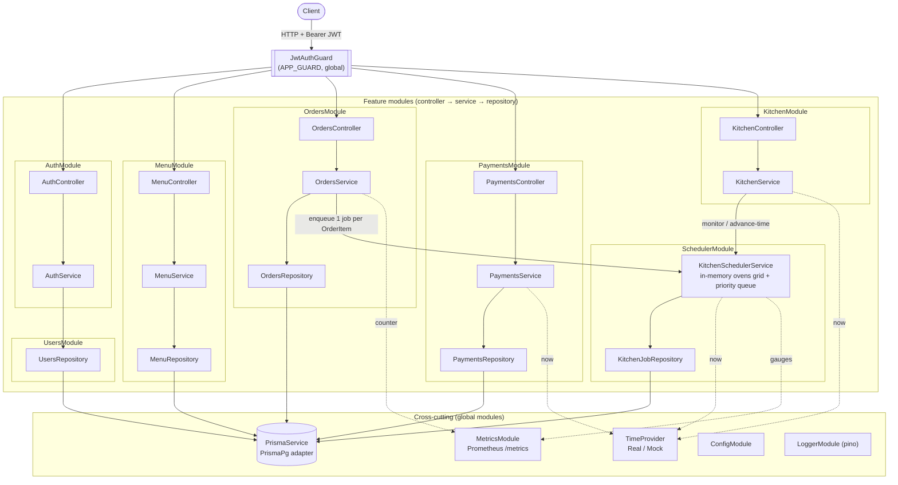

# Architecture

Snack Builders Bakery API is a **NestJS monolith** backed by PostgreSQL (Prisma 7,
`PrismaPg` adapter). Every feature is a self-contained module following a
**controller → service → repository → Prisma** layering. All routes are
JWT-protected globally (`APP_GUARD`); endpoints opt out with `@Public()` and add
role checks with `@Roles()` + `RolesGuard`.

These diagrams are generated from the current source and render natively on GitHub.

## Module & layer dependencies



**Notes**

- `OrdersModule` and `KitchenModule` both import `SchedulerModule`; the scheduler is
  the single owner of the in-memory oven grid, so HTTP traffic from two modules
  funnels through one mutex-guarded service.
- `AuthModule` delegates user lookups to `UsersModule` (`UsersRepository`) instead of
  touching Prisma directly, keeping persistence behind repositories everywhere.
- `PrismaModule`, `TimeProviderModule` and `MetricsModule` are `@Global()`; metrics
  are injected as `@Optional()` so the app boots without the metrics module.

## Order lifecycle (request flow)

```mermaid
sequenceDiagram
    actor C as Customer
    participant API as OrdersController
    participant OS as OrdersService
    participant OR as OrdersRepository
    participant KS as KitchenSchedulerService
    participant KR as KitchenJobRepository
    participant DB as PostgreSQL

    C->>API: POST /orders (JWT, CUSTOMER)
    API->>OS: createOrder(dto)
    OS->>OR: validate items + create order (transaction)
    OR->>DB: INSERT Order + OrderItems
    loop one KitchenJob per OrderItem
        OS->>KS: enqueue(job)
        alt free oven slot
            KS->>KR: createBaking(job)
            KR->>DB: INSERT KitchenJob (BAKING) + Order → BAKING
        else all 6 slots busy
            KS-->>KS: insert into priority queue (in-memory only)
        end
    end
    OS-->>C: ticket { orderId, estimatedReadyAt, items }

    Note over KS,DB: clock advances → bake completes
    KS->>KR: markDone(orderItemId)
    KR->>DB: KitchenJob → DONE; Order → READY once all items done

    C->>API: POST /payments (Order must be READY)
    API->>DB: PaymentRecord (COMPLETED) + Order → PAID
```

**Order status:** `PENDING → BAKING → READY → PAID`. The transition to `BAKING`
happens when the order's first item starts baking; `READY` once every item is
`DONE`. Only `BAKING` and `DONE` kitchen-job states are persisted — `QUEUED` jobs
live in memory and are lost on restart.
