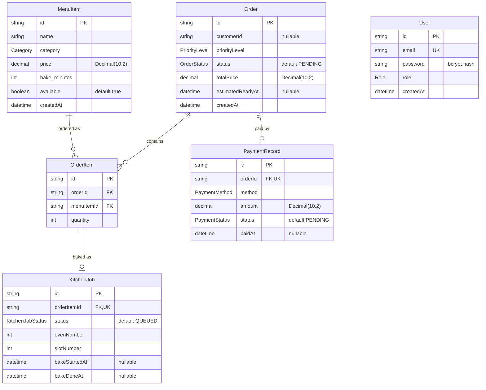

# Database — Entity Relationship

PostgreSQL schema managed by **Prisma 7** (`prisma/schema.prisma`). All primary keys
are `cuid()` strings. This diagram is generated from the current schema and renders
natively on GitHub.

**Cardinality notes**

- `MenuItem 1—N OrderItem` — a catalogue item appears in many order lines.
- `Order 1—N OrderItem` — an order is composed of one or more line items.
- `Order 1—0..1 PaymentRecord` — `PaymentRecord.orderId` is `@unique`, so each order
  has at most one payment.
- `OrderItem 1—0..1 KitchenJob` — `KitchenJob.orderItemId` is `@unique`; the job is
  created only once the item starts baking (`QUEUED` jobs live in memory, not in the DB).
- `User` is standalone — there is no FK from `Order.customerId` to `User`; the customer
  id is taken from the JWT claim, not a database relation.

## Enumerations

| Enum | Values |
|---|---|
| `Role` | `CUSTOMER` · `STORE_MANAGER` · `KITCHEN_MANAGER` |
| `Category` | `COOKIE` · `PASTRY` · `BREAD` |
| `PriorityLevel` | `TIER1` · `TIER2` · `TIER3` |
| `OrderStatus` | `PENDING` → `BAKING` → `READY` → `PAID` |
| `PaymentMethod` | `CASH` · `CARD` |
| `PaymentStatus` | `PENDING` · `COMPLETED` |
| `KitchenJobStatus` | `QUEUED` · `BAKING` · `DONE` |
